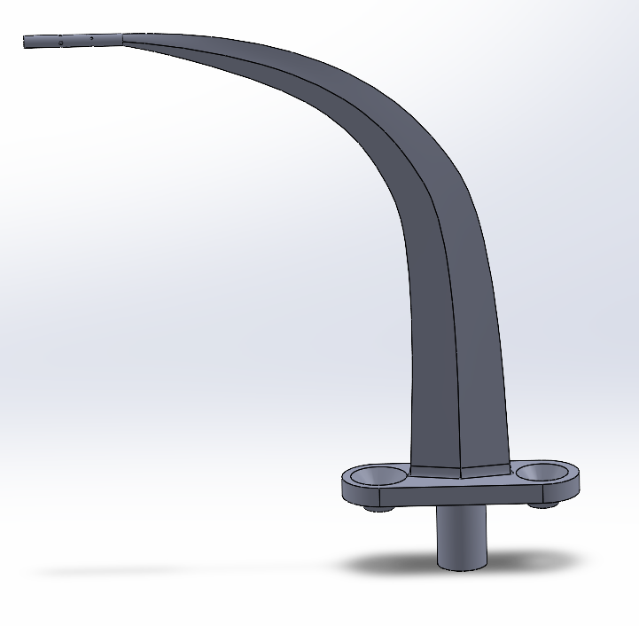
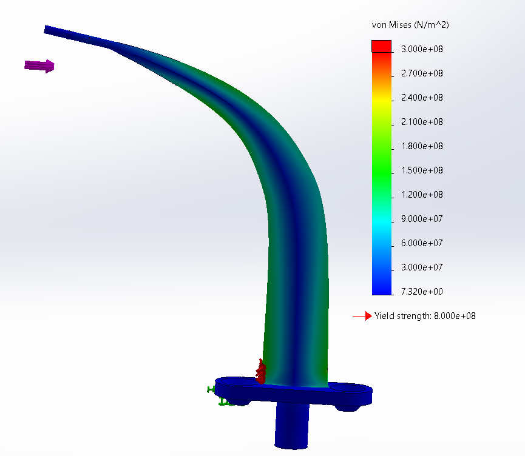
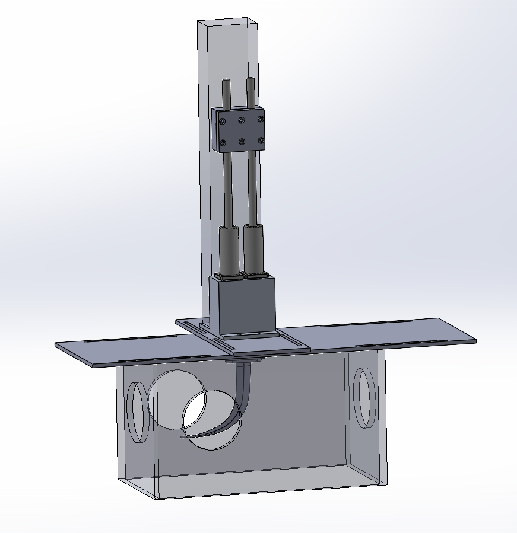
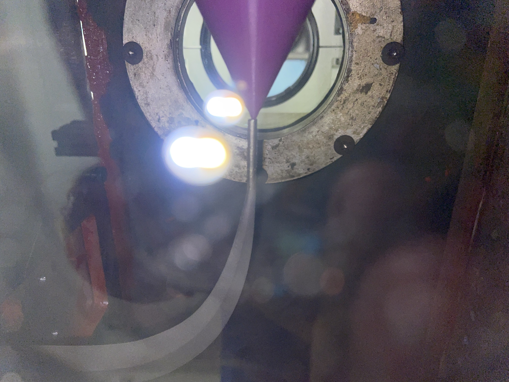
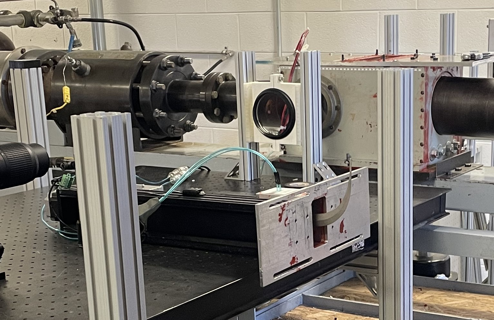
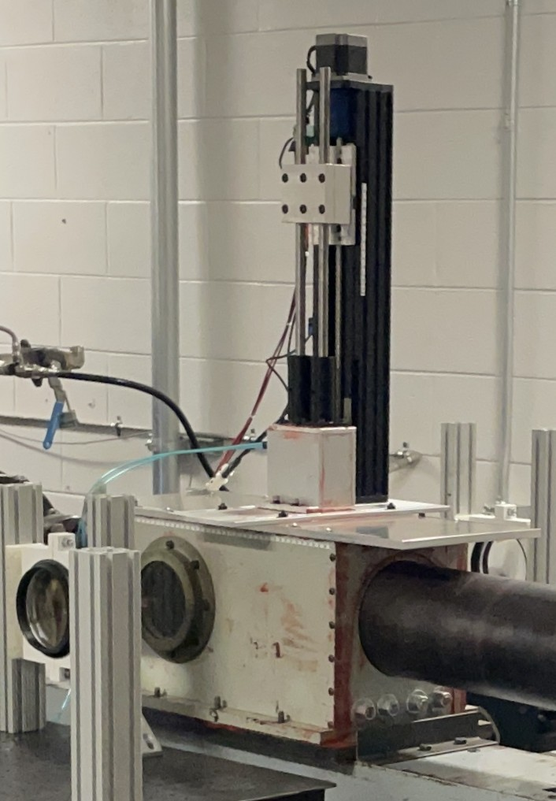

# Chad Noyes

Aerospace Engineering Masters Student at Florida Institute of Technology

---

## Resume

📄 [View Resume](Chad_Noyes_Resume.pdf)

---

## Projects

### PHASE Hypersonic Traversing Pitot Tube 
Hypersonic Pitot-Static Probe Design – PHASE Research Group, Virginia Tech

Designed and fabricated a vertically traversing hypersonic pitot-static probe for the PHASE Research Group at Virginia Tech. The instrument was subsequently used to characterize inflow uniformity in the Hypersonic Wind Tunnel, supporting research published in AIAA SciTech 2026 Forum (Paper No. 2026-0870). Contributions to the project were recognized in the paper's acknowledgements.

Publication:

D. L. Daniels, B. Tomer, G. Hunt, N. Davis, and L. Joseph, "Characterizing the Mach 6 Flow of Virginia Tech's Hypersonic Wind Tunnel," AIAA SCITECH 2026 Forum, Orlando, FL, Jan. 12–16, 2026, Paper AIAA 2026-0870. https://doi.org/10.2514/6.2026-0870

#### Design & Analysis
- Designed the pitot-static probe geometry for hypersonic testing.
- Performed CFD to estimate aerodynamic loading.
- Performed FEA to evaluate stresses and structural compliance.
- Designed a vertical traverse mechanism to obtain multiple pressure measurements during a single wind tunnel firing.
- Integrated the traverse with the existing LabVIEW data acquisition system.
#### Engineering Challenges
- Six-week schedule from concept to operational hardware.
- Designing a compact traverse mechanism that fit within the limited space of the hypersonic wind tunnel test section.
- Designing a traverse lid assembly that maintained the vacuum integrity of the test chamber while supporting the traversing mechanism.
- Balancing structural stiffness with a low-profile design.
- Completing the project within a limited research budget.
- Mechanical, electrical, and software integration with the existing LabVIEW DAQ system.
- Achieving repeatable probe positioning within the wind tunnel.
#### Manufacturing & Build
- Pitot probe manufactured via commercial 3D printing.
- Worked with labrotory machine shop for remaining manufacturing.
- Integrated stepper-driven traverse, mounting hardware, and instrumentation.
- Performed final assembly and integration of the entire traverse system.
#### Results
- Successfully deployed for hypersonic testing.
- Captured inflow survey measurements throughout the test section.
- Reliable operation during wind tunnel campaigns.
- Supported research published in AIAA SciTech 2026 (Paper 2026-0870)

#### Pictures:

CAD model of the pitot tube.

Structural finite element analysis (FEA) of the pitot tube.

Complete traverse and pitot tube assembly.

Pitot tube installed in the wind tunnel and aligned with the datum.

Pitot tube removed from the wind tunnel.

Pitot tube mounted on the hypersonic wind tunnel.

### Senior Design Project — Virginia Tech  
*Aerodynamics Lead · Team won 1st place prize*

Led aerodynamics analysis and design efforts for a multidisciplinary senior design team project. Contributed to overall system performance and helped guide the team to a 1st place award.

#### Design & Analysis
- Performed aerodynamic sizing and trade studies.
- Evaluated wing planform and configuration alternatives.
- Iterated designs to meet performance requirements while coordinating with structures and weight estimation teams.
- Evaluated aerodynamic characteristics throughout the design process
#### Engineering Challenges
- Maintaining aerodynamic performance as aircraft weight and balance evolved.
- Balancing competing objectives including range, stability, and stealth.
- Minimizing redesign as other subsystems matured.
- Coordinating changes across a multidisciplinary engineering team.
#### Build
- Produced complete aircraft design package.
- Generated performance analyses and technical justification.
- Presented design to faculty and industry judges.
#### Results
- Team awarded 1st Place among senior design projects.
- Final configuration met performance objectives while satisfying multidisciplinary design constraints.

📄 [View Full Report](AOE_4066_Final_Report_Team_2.pdf)

### Mechatronics Project 5
*Florida Institute of Technology · Spring 2026*

Designed and implemented an optimized Linear Quadratic Regulator (LQR) controller for a DC motor system, analyzing closed-loop performance and control response.

📄 [View Full Report](prog5ChadNoyes.pdf)

### Composites Project
*Florida Institute of Technology · Spring 2026*

Performed finite element analysis to investigate the thermal buckling behavior of composite plates.

📄 [View Full Report](Composites_Report.pdf)

### Topology Optimization of a Rotating Blade
*Florida Institute of Technology · Fall 2025*

Used ANSYS topology optimization to minimize weight and improve structural efficiency of a rotating blade while maintaining performance requirements.

📄 [View Full Report](FEM_Project_2.pdf)

## Contact

- Email: chadnoyes@vt.edu
- Phone: 609-602-6242 
- LinkedIn: https://linkedin.com/in/chad-noyes
